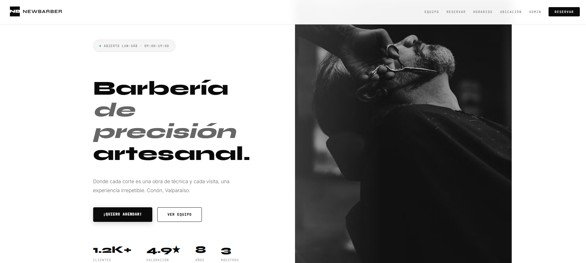

<p align="center">


</p>

---

<p align="center">

<a href="https://barberia-lovat.vercel.app/" target="_blank">
  
</a>

<a href="https://github.com/TUUSUARIO/informe_johnic" target="_blank">
  
</a>

</p>

---

# 💈 Barbería NEW BARBER

Plataforma web moderna para barbería desarrollada con tecnologías actuales, enfocada en diseño elegante, experiencia de usuario fluida y alto rendimiento.

---

## ✨ Características

✅ Diseño moderno y minimalista  
✅ Animaciones suaves y fluidas  
✅ Responsive Design  
✅ Navegación intuitiva  
✅ Optimización de rendimiento  
✅ Componentes reutilizables  
✅ Interfaz elegante y profesional  
✅ Compatible con dispositivos móviles  

---

## 🌐 Demo Online

🔗 https://barberia-lovat.vercel.app/

---

## 📸 Vista previa

<p align="center">
  
</p>

---

## 🛠️ Tecnologías utilizadas

<p align="center">


</p>

---

## 📂 Estructura del proyecto

```bash
src/
 ├── assets/
 ├── components/
 ├── pages/
 ├── styles/
 ├── App.tsx
 └── main.tsx